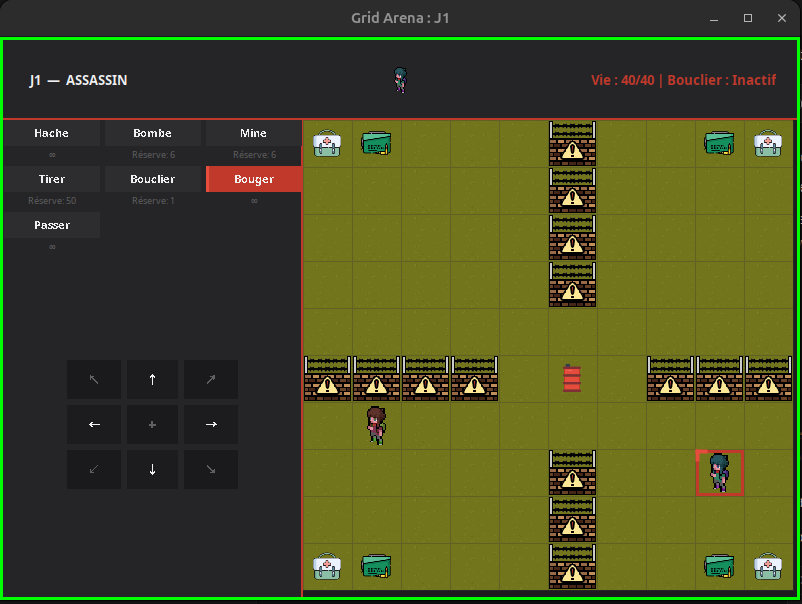
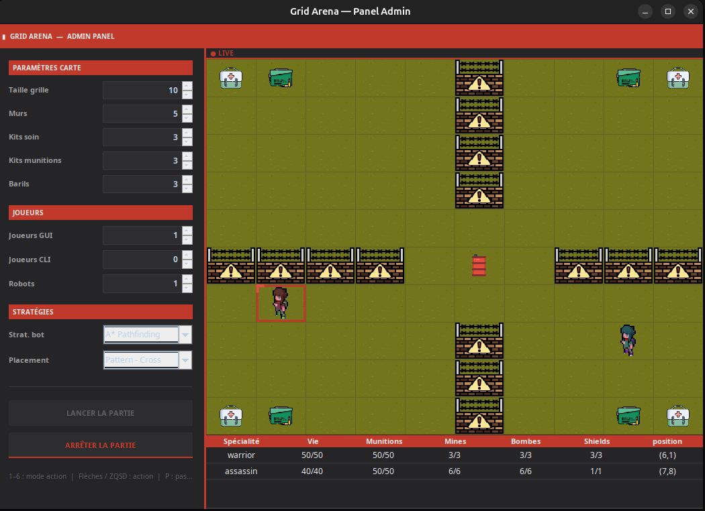
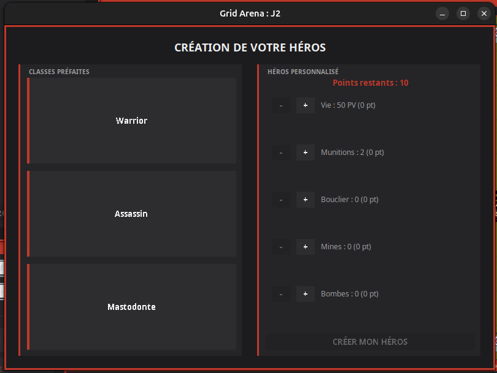
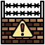
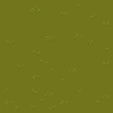
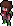
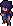
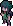

# Gridarena - Jeu de combat au tour par tour

## Description

**Gridarena** est un jeu de combat tactique au tour par tour développé en Java. Ce projet implémente une architecture **MVC (Modèle-Vue-Contrôleur)** robuste et intègre plusieurs **Design Patterns** fondamentaux. 

Les joueurs s'affrontent sur une grille bidimensionnelle parsemée d'obstacles et de bonus, en utilisant diverses compétences tactiques (tir, hache, bombes, mines, bouclier).

## Captures d'Écran

### Vue du joueur


### Vue du panel admin


### Sélection du personnage


## Règles du Jeu

À chaque tour, un joueur peut effectuer une action parmi :
- **Se déplacer** d'une case (Haut, Bas, Gauche, Droite).
- **Poser une mine** (invisible pour les adversaires) sur l'une des 8 cases adjacentes.
- **Poser une bombe** (qui explose après 3 tours dans un rayon donné) sur l'une des 8 cases adjacentes.
- **Tirer à distance** horizontalement ou verticalement (consomme des munitions, portée infinie sans obstacle).
- **Activer un bouclier** pour devenir invincible durant ce tour.
- **Donner un coup de hache** au corps à corps (Haut, Bas, Gauche, Droite).
- **Passer son tour**.

La grille contient initialement des obstacles destructibles (**barils explosifs**), des **murs**, des **kits de soins** (+PV) et des **boîtes de munitions**.

## Comment Lancer l'Application

Le projet utilise **Maven** pour la gestion de build. Assurez-vous d'avoir Java 21+ et Maven installés.

### 1. Compiler et Empaqueter le Projet
Générez le JAR exécutable dans le dossier `target/` :
```bash
mvn clean package
```

### 2. Exécuter l'Application
Vous pouvez lancer le jeu directement via Maven :
```bash
mvn exec:java
```

## Crédits des Images

| Image | Auteur / Licence |
| :---: | :---: |
|  | [mine - FontAwesome](https://fontawesome.com/) |
|  | [health - Freepik](https://fr.freepik.com/) |
|  | [barrel - Freepik](https://fr.freepik.com/) |
|  | [wall - Freepik](https://fr.freepik.com/) |
|  | [bomb - Freepik](https://fr.freepik.com/) |
|  | [ammo - Freepik](https://fr.freepik.com/) |
|  | [décor - Cupnooble](https://cupnooble.itch.io/sprout-lands-asset-pack) |
|  | [héros vert - sscary.itch](https://sscary.itch.io/the-adventurer-male) |
|  | [héros violet - sscary.itch](https://sscary.itch.io/the-adventurer-male) |
|  | [héros bleu - sscary.itch](https://sscary.itch.io/the-adventurer-male) |

---

## Auteurs & Contributeurs

- **Florian Pépin**
- **Tom David** ([kitoutou999](https://github.com/kitoutou999))
- **Emilien Huron**

---

## Licence

Ce projet est disponible sous licence **MIT**. Voir le fichier [LICENSE.md](./LICENSE.md) pour plus de détails.
